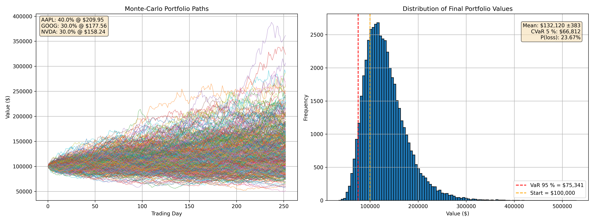

# 📈 Quant Simulations &nbsp;·&nbsp; Monte-Carlo GBM Portfolio Pricer

<p align="center">
  
</p>

A lightning-fast, **fully-vectorised** Monte-Carlo engine for pricing single stocks **and** weighted equity portfolios under a **Geometric Brownian Motion** (GBM) model.  
The simulator is calibrated on-the-fly from historical prices pulled with **[yfinance]**, generates up to **100 k** antithetic paths in seconds, and spits out crystal-clear risk metrics & plots ready for reports or slide decks.

---

## ✨ Key Features
- **Multi-asset or single-asset** workflows — two ready-to-run scripts.
- **Historical calibration** of drift (μ), volatility (σ) and full covariance (Σ).
- **Antithetic variance-reduction** & pure NumPy vectorisation → *blazing-fast*.
- **Fan plot + histogram** automatically saved as PNG in `./outputs/`.
- **Risk statistics**: mean ± 95 % CI, VaR<sub>95 %</sub>, CVaR<sub>95 %</sub>, prob. of loss.
- Clean **CLI flags** so you never have to edit the source.
- Minimal, reproducible **`requirements.txt`** (NumPy, Pandas, Matplotlib, yfinance).
- MIT-licensed & ready for GitHub Actions / Codespaces.

---

## 🚀 Quick Start

```bash
# 1 · Clone & install deps
git clone https://github.com/your-handle/quant_simulations.git
cd quant_simulations
python -m venv .venv && source .venv/bin/activate
pip install -r requirements.txt

# 2 · Run a multi-asset portfolio simulation
python monet_carlo_gbm_multi_asset_portfolio.py \
  -t AAPL MSFT NVDA \
  -w 0.4 0.3 0.3 \
  -p 100000               # Monte-Carlo paths (default 50 k)

# 3 · Or price a single equity
python gbm_single_asset_demo.py -t GOOG -p 80000 -y 3
```
## Results land in outputs/:
```
outputs/
├─ gbm_portfolio.png
├─ gbm_final_values.csv
├─ GOOG_gbm_sim.png
└─ GOOG_final_values.csv
```

## 🛠️ Command-line Reference


| Script                                         | Purpose                       | Essential Flags                                                                       |
| ---------------------------------------------- | ----------------------------- | ------------------------------------------------------------------------------------- |
| **`monet_carlo_gbm_multi_asset_portfolio.py`** | Simulate a weighted portfolio | `-t/--tickers` list  ·  `-w/--weights` list  ·  `-p/--paths` int  ·  `-y/--years` int |
| **`gbm_single_asset_demo.py`**                 | Simulate one equity           | `-t/--ticker` str  ·  `-p/--paths` int  ·  `-y/--years` int                           |

Run any script with -h to see all options.

## 📊 Risk Metrics Explained
| Metric             | Meaning                                       |
| ------------------ | --------------------------------------------- |
| **Mean ± 95 % CI** | Expected final value with confidence interval |
| **VaR 95 %**       | Worst loss not exceeded 95 % of the time      |
| **CVaR 95 %**      | Average loss given that VaR is breached       |
| **P(loss)**        | Probability final value < initial capital     |


## 🙌 Acknowledgements
+ NumPy & Pandas for the heavy lifting
+ Matplotlib for the crisp visuals
+ yfinance for painless data access
